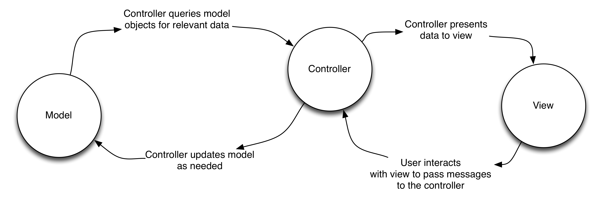

# [fit] Activities and MVC

--- 

# Model 

  * Application data and logic 
  * Unaware of User Interface 
  * Typically inherit directly from java.lang.Object or from another custom object

---

# View

  * Know how to draw themselves on the screen
  * Are often provided by Android, but can be custom
  * Pretty much anything you can see on the screen 
  * Often referred to as "widgets" 

---

# Controller

  * Connect model objects with view objects 
  * Activities, Fragments, and Services 
  * Ensures that models and views are decoupled and reusable

---

# Interfaces

###Interfaces are used in Android to define contracts; stating how different components interact with eachother

---

---

# Activity

  * Subclass Activity to encapsulate controller logic 
  * Applications can have many activities 
  * Activities interact with or inflate layouts 

---

# Context 

  * Activities are subclasses of Context 
  * Provide global application environment info 
  * Will often get passed between Activities and related classes such as adapters and asyncTasks (as 'this')

	

